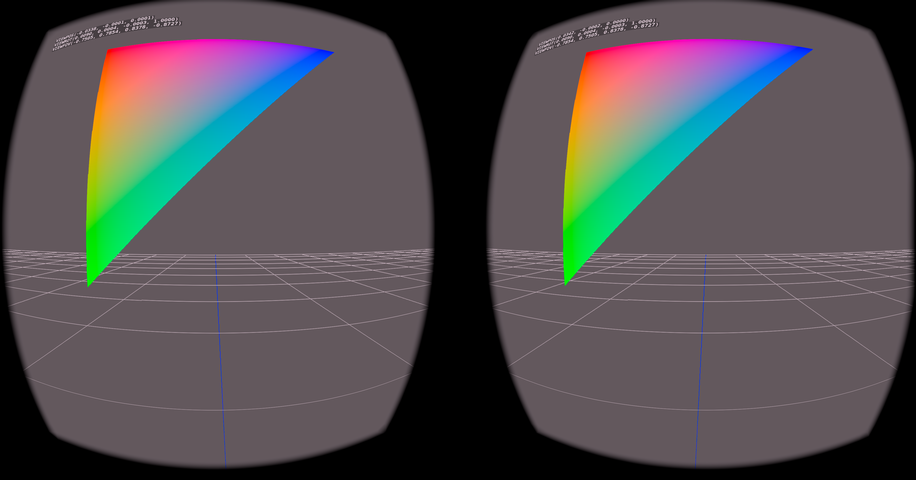

# android_openxr_gles
VR sample applications on Android NDK using OpenXR + OpenGLES. (especially  for Meta Quest2)

## 1. Applications

### [gl2gridOXR](https://github.com/terryky/android_openxr_gles/tree/master/gl2gridOXR)
- display the grid mesh. 

### [gl2triOXR](https://github.com/terryky/android_openxr_gles/tree/master/gl2triOXR)
- Just a triangle without parallax. 

### [gl2tri3dOXR](https://github.com/terryky/android_openxr_gles/tree/master/gl2tri3dOXR)
- Just a triangle in 3D space with parallax. 

