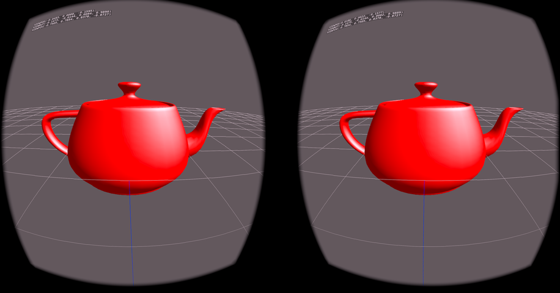
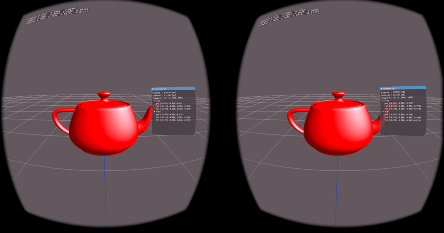

# android_openxr_gles
VR sample applications on Android NDK using OpenXR + OpenGLES. (especially  for Meta Quest2)


## 1. Applications

### [gl2gridOXR](https://github.com/terryky/android_openxr_gles/tree/master/gl2gridOXR)
- display the grid mesh.<br>
[](https://github.com/terryky/android_openxr_gles/tree/master/gl2gridOXR)

### [gl2triOXR](https://github.com/terryky/android_openxr_gles/tree/master/gl2triOXR)
- Just a triangle without parallax.<br>
[](https://github.com/terryky/android_openxr_gles/tree/master/gl2triOXR)

### [gl2tri3dOXR](https://github.com/terryky/android_openxr_gles/tree/master/gl2tri3dOXR)
- Just a triangle in 3D space with parallax.<br>
[](https://github.com/terryky/android_openxr_gles/tree/master/gl2tri3dOXR)

### [gl2teapotOXR](https://github.com/terryky/android_openxr_gles/tree/master/gl2teapotOXR)
- draw a teapot 3D model.<br>
[](https://github.com/terryky/android_openxr_gles/tree/master/gl2teapotOXR)

### [gl2imguiOXR](https://github.com/terryky/android_openxr_gles/tree/master/gl2imguiOXR)
- draw UI Layer using ImGui.<br>
[](https://github.com/terryky/android_openxr_gles/tree/master/gl2imguiOXR)

### [gl2hittestOXR](https://github.com/terryky/android_openxr_gles/tree/master/gl2hittestOXR)
- invoke the hand controller ray intersection test and draw a free curve.<br>
[](https://github.com/terryky/android_openxr_gles/tree/master/gl2hittestOXR)


## 2. How to Build & Run

### 2.1 Initial settings.

```
$ mkdir ~/work
$ git clone https://github.com/terryky/android_openxr_gles.git
$ cd android_openxr_gles
$ ./initial_setup.sh
```


### 2.2 Build Android Applications
- Download and install [Android Studio](https://developer.android.com/studio/install).
- Start Android Studio.

```
$ cd ${ANDROID_STUDIO_INSTALL_DIR}/android-studio/bin/
$ ./studio.sh
```

- Open application folder (eg. ```~/work/android_openxr_gles/gl2teapotOXR```).
- Build and Run.


## 3. Tested Environment

|        | Host PC                          | Target Device           |
|:------:|:--------------------------------:|:-----------------------:|
| ARCH   | x86_64                           | Meta Quest2 (arm64-v8a) |
| OS     | Ubuntu 20.04.3 LTS               | Android (API Level 30)  |
| SDK    | Android NDK r21.4.7075529        | Runtime 38.0.0.82.728   |
|        | Android Studio 2021.1.1.23-linux |                         |


## 4.  Acknowledgements

- https://github.com/daj/OculusHelloXR

